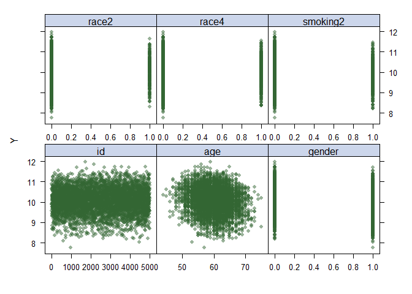
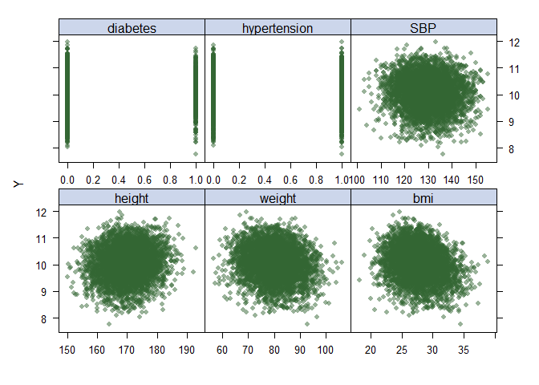
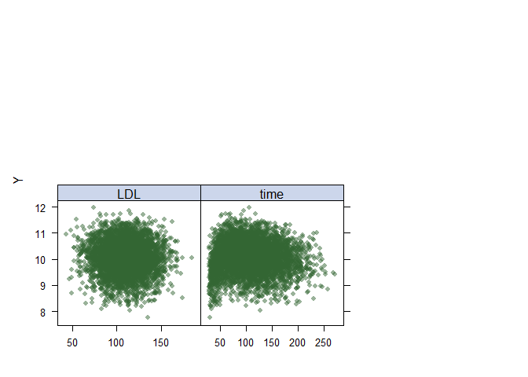

Data Science 2 Midterm
================

### Loading Data

``` r
load("dat1.RData")
```

### Understanding linearity of variables in dat1:

``` r
library(caret)
```

    ## Loading required package: ggplot2

    ## Loading required package: lattice

``` r
library(tidymodels)
```

    ## ── Attaching packages ────────────────────────────────────── tidymodels 1.3.0 ──

    ## ✔ broom        1.0.7     ✔ rsample      1.2.1
    ## ✔ dials        1.4.0     ✔ tibble       3.2.1
    ## ✔ dplyr        1.1.4     ✔ tidyr        1.3.1
    ## ✔ infer        1.0.7     ✔ tune         1.3.0
    ## ✔ modeldata    1.4.0     ✔ workflows    1.2.0
    ## ✔ parsnip      1.3.0     ✔ workflowsets 1.1.0
    ## ✔ purrr        1.0.4     ✔ yardstick    1.3.2
    ## ✔ recipes      1.1.1

    ## ── Conflicts ───────────────────────────────────────── tidymodels_conflicts() ──
    ## ✖ purrr::discard()         masks scales::discard()
    ## ✖ dplyr::filter()          masks stats::filter()
    ## ✖ dplyr::lag()             masks stats::lag()
    ## ✖ purrr::lift()            masks caret::lift()
    ## ✖ yardstick::precision()   masks caret::precision()
    ## ✖ yardstick::recall()      masks caret::recall()
    ## ✖ yardstick::sensitivity() masks caret::sensitivity()
    ## ✖ yardstick::specificity() masks caret::specificity()
    ## ✖ recipes::step()          masks stats::step()

``` r
library(splines)
library(mgcv)
```

    ## Loading required package: nlme

    ## 
    ## Attaching package: 'nlme'

    ## The following object is masked from 'package:dplyr':
    ## 
    ##     collapse

    ## This is mgcv 1.9-1. For overview type 'help("mgcv-package")'.

``` r
library(pdp)
```

    ## 
    ## Attaching package: 'pdp'

    ## The following object is masked from 'package:purrr':
    ## 
    ##     partial

``` r
library(earth)
```

    ## Loading required package: Formula

    ## Loading required package: plotmo

    ## Loading required package: plotrix

    ## 
    ## Attaching package: 'plotrix'

    ## The following object is masked from 'package:scales':
    ## 
    ##     rescale

``` r
library(tidyverse)
```

    ## ── Attaching core tidyverse packages ──────────────────────── tidyverse 2.0.0 ──
    ## ✔ forcats   1.0.0     ✔ readr     2.1.5
    ## ✔ lubridate 1.9.3     ✔ stringr   1.5.1

    ## ── Conflicts ────────────────────────────────────────── tidyverse_conflicts() ──
    ## ✖ readr::col_factor() masks scales::col_factor()
    ## ✖ nlme::collapse()    masks dplyr::collapse()
    ## ✖ purrr::discard()    masks scales::discard()
    ## ✖ dplyr::filter()     masks stats::filter()
    ## ✖ stringr::fixed()    masks recipes::fixed()
    ## ✖ dplyr::lag()        masks stats::lag()
    ## ✖ purrr::lift()       masks caret::lift()
    ## ✖ pdp::partial()      masks purrr::partial()
    ## ✖ readr::spec()       masks yardstick::spec()
    ## ℹ Use the conflicted package (<http://conflicted.r-lib.org/>) to force all conflicts to become errors

``` r
library(ggplot2)
library(bayesQR) 

data(dat1)
```

    ## Warning in data(dat1): data set 'dat1' not found

``` r
x = model.matrix(log_antibody ~ ., dat1)[,-1]
y = dat1$log_antibody

theme1 <- trellis.par.get()
theme1$plot.symbol$col <- rgb(.2, .4, .2, .5)
theme1$plot.symbol$pch <- 16
theme1$plot.line$col <- rgb(.8, .1, .1, 1)
theme1$plot.line$lwd <- 2
theme1$strip.background$col <- rgb(.0, .2, .6, .2)

trellis.par.set(theme1)

featurePlot(x[, -c(5, 7)], y, plot = "scatter", labels = c("", "Y"),
type = c("p"), layout = c(3, 2))
```

<!-- --><!-- --><!-- -->

All variables of interest are binary or continuous. The variables that
are continuous are showing non-linear function. Given this, the optimal
model to use to explore the nonlinear relationships between predictors
of interest and antibody level, is a Generalized Additive Model (GAM).

### Generalized Additive Model (GAM)

``` r
set.seed(2)
```
