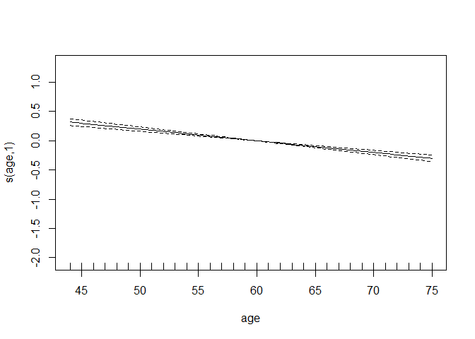
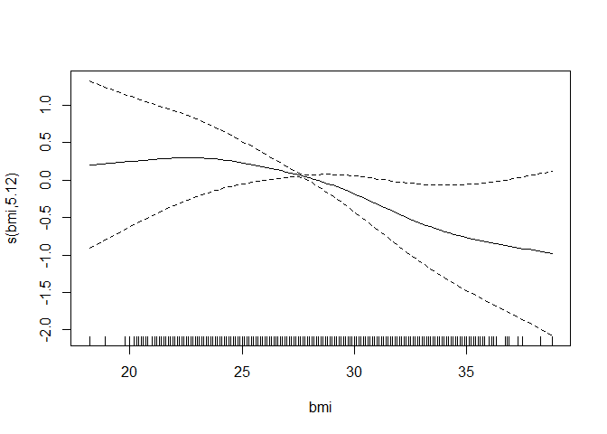
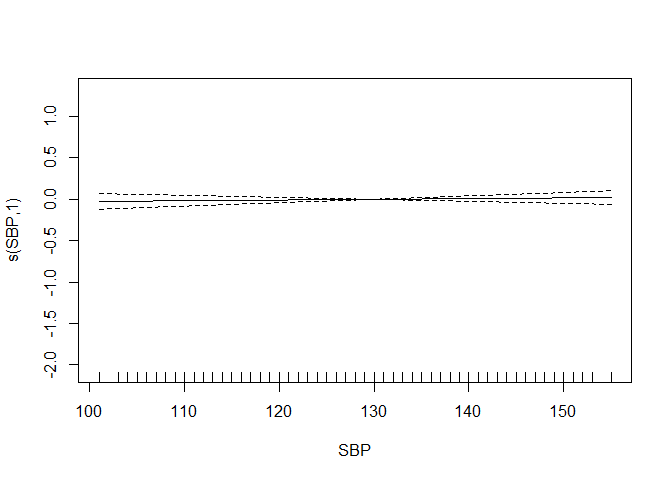
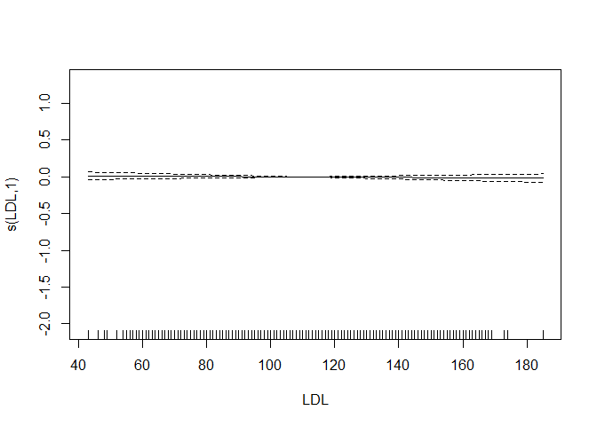
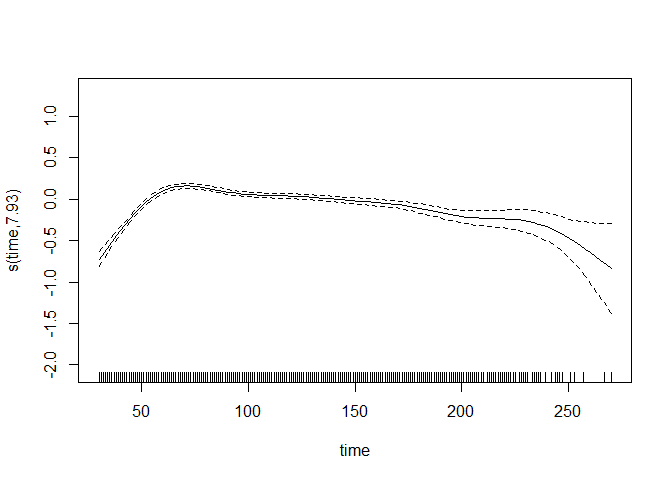
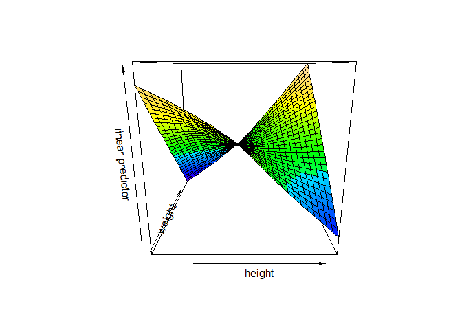

Data Science 2 Midterm
================

### Loading Data

``` r
load("dat1.RData")
```

### Understanding linearity of variables in dat1:

``` r
library(caret)
```

    ## Loading required package: ggplot2

    ## Loading required package: lattice

``` r
library(tidymodels)
```

    ## ── Attaching packages ────────────────────────────────────── tidymodels 1.3.0 ──

    ## ✔ broom        1.0.7     ✔ rsample      1.2.1
    ## ✔ dials        1.4.0     ✔ tibble       3.2.1
    ## ✔ dplyr        1.1.4     ✔ tidyr        1.3.1
    ## ✔ infer        1.0.7     ✔ tune         1.3.0
    ## ✔ modeldata    1.4.0     ✔ workflows    1.2.0
    ## ✔ parsnip      1.3.0     ✔ workflowsets 1.1.0
    ## ✔ purrr        1.0.4     ✔ yardstick    1.3.2
    ## ✔ recipes      1.1.1

    ## ── Conflicts ───────────────────────────────────────── tidymodels_conflicts() ──
    ## ✖ purrr::discard()         masks scales::discard()
    ## ✖ dplyr::filter()          masks stats::filter()
    ## ✖ dplyr::lag()             masks stats::lag()
    ## ✖ purrr::lift()            masks caret::lift()
    ## ✖ yardstick::precision()   masks caret::precision()
    ## ✖ yardstick::recall()      masks caret::recall()
    ## ✖ yardstick::sensitivity() masks caret::sensitivity()
    ## ✖ yardstick::specificity() masks caret::specificity()
    ## ✖ recipes::step()          masks stats::step()

``` r
library(splines)
library(mgcv)
```

    ## Loading required package: nlme

    ## 
    ## Attaching package: 'nlme'

    ## The following object is masked from 'package:dplyr':
    ## 
    ##     collapse

    ## This is mgcv 1.9-1. For overview type 'help("mgcv-package")'.

``` r
library(pdp)
```

    ## 
    ## Attaching package: 'pdp'

    ## The following object is masked from 'package:purrr':
    ## 
    ##     partial

``` r
library(earth)
```

    ## Loading required package: Formula

    ## Loading required package: plotmo

    ## Loading required package: plotrix

    ## 
    ## Attaching package: 'plotrix'

    ## The following object is masked from 'package:scales':
    ## 
    ##     rescale

``` r
library(tidyverse)
```

    ## ── Attaching core tidyverse packages ──────────────────────── tidyverse 2.0.0 ──
    ## ✔ forcats   1.0.0     ✔ readr     2.1.5
    ## ✔ lubridate 1.9.3     ✔ stringr   1.5.1

    ## ── Conflicts ────────────────────────────────────────── tidyverse_conflicts() ──
    ## ✖ readr::col_factor() masks scales::col_factor()
    ## ✖ nlme::collapse()    masks dplyr::collapse()
    ## ✖ purrr::discard()    masks scales::discard()
    ## ✖ dplyr::filter()     masks stats::filter()
    ## ✖ stringr::fixed()    masks recipes::fixed()
    ## ✖ dplyr::lag()        masks stats::lag()
    ## ✖ purrr::lift()       masks caret::lift()
    ## ✖ pdp::partial()      masks purrr::partial()
    ## ✖ readr::spec()       masks yardstick::spec()
    ## ℹ Use the conflicted package (<http://conflicted.r-lib.org/>) to force all conflicts to become errors

``` r
library(ggplot2)
library(bayesQR) 

data(dat1)
```

    ## Warning in data(dat1): data set 'dat1' not found

``` r
x = model.matrix(log_antibody ~ ., dat1)
y = dat1$log_antibody

theme1 <- trellis.par.get()
theme1$plot.symbol$col <- rgb(.2, .4, .2, .5)
theme1$plot.symbol$pch <- 16
theme1$plot.line$col <- rgb(.8, .1, .1, 1)
theme1$plot.line$lwd <- 2
theme1$strip.background$col <- rgb(.0, .2, .6, .2)

trellis.par.set(theme1)

featurePlot(x[, -c(5, 7)], y, plot = "scatter", labels = c("", "Y"),
type = c("p"), layout = c(3, 2))
```

<!-- --><!-- --><!-- -->

All variables of interest are binary or continuous. The variables that
are continuous are showing non-linear function. Given this, the optimal
model to use to explore the nonlinear relationships between predictors
of interest and antibody level, is a Generalized Additive Model (GAM).

### Creating factors for the Race and Smoking variables to use in the model

``` r
dat1$race = factor(dat1$race, 
                         levels = c(1, 2, 3, 4), 
                         labels = c("White", "Asian", "Black", "Hispanic"))

dat1$smoking = factor(dat1$smoking, 
                            levels = c(0, 1, 2), 
                            labels = c("Never", "Former", "Current"))

dat1$race = relevel(dat1$race, ref = "White")
dat1$smoking = relevel(dat1$smoking, ref = "Never")
```

### Generalized Additive Model (GAM)

``` r
set.seed(2)

gam.m1 = gam(log_antibody ~ age + gender + race + smoking + height + weight + bmi + diabetes + hypertension + SBP + LDL + time,
data = dat1)

gam.m2 = gam(log_antibody ~ s(age) + gender + race + smoking + height + weight + s(bmi) + diabetes + hypertension + s(SBP) + s(LDL) + s(time),
data = dat1)

gam.m3 = gam(log_antibody ~ s(age) + gender + race + smoking + te(height, weight) + s(bmi) + diabetes + hypertension + s(SBP) + s(LDL) + s(time),
data = dat1)

anova(gam.m1, gam.m2, gam.m3, test = "F")
```

    ## Analysis of Deviance Table
    ## 
    ## Model 1: log_antibody ~ age + gender + race + smoking + height + weight + 
    ##     bmi + diabetes + hypertension + SBP + LDL + time
    ## Model 2: log_antibody ~ s(age) + gender + race + smoking + height + weight + 
    ##     s(bmi) + diabetes + hypertension + s(SBP) + s(LDL) + s(time)
    ## Model 3: log_antibody ~ s(age) + gender + race + smoking + te(height, 
    ##     weight) + s(bmi) + diabetes + hypertension + s(SBP) + s(LDL) + 
    ##     s(time)
    ##   Resid. Df Resid. Dev      Df Deviance       F Pr(>F)    
    ## 1    4984.0     1509.4                                    
    ## 2    4971.2     1380.0 12.8235  129.390 36.3775 <2e-16 ***
    ## 3    4968.5     1378.8  2.6365    1.235  1.6882 0.1739    
    ## ---
    ## Signif. codes:  0 '***' 0.001 '**' 0.01 '*' 0.05 '.' 0.1 ' ' 1

``` r
plot(gam.m2)
```

<!-- --><!-- --><!-- --><!-- --><!-- -->

``` r
vis.gam(gam.m3, view = c("height","weight"),
color = "topo")
```

<!-- -->

``` r
ctrl1 = trainControl(method = "cv", number = 10)
x = dat1[, c("age", "gender", "race", "smoking", "height", "weight", "bmi", 
              "diabetes", "hypertension", "SBP", "LDL", "time")]
y = dat1$log_antibody

set.seed(2)
gam.fit = train(x, y,
method = "gam",
trControl = ctrl1)
gam.fit$bestTune
```

    ##   select method
    ## 2   TRUE GCV.Cp

``` r
gam.fit$finalModel
```

    ## 
    ## Family: gaussian 
    ## Link function: identity 
    ## 
    ## Formula:
    ## .outcome ~ gender + diabetes + hypertension + smoking + race + 
    ##     s(age) + s(SBP) + s(LDL) + s(bmi) + s(time) + s(height) + 
    ##     s(weight)
    ## 
    ## Estimated degrees of freedom:
    ## 0.991 0.000 0.000 4.179 7.892 1.234 0.000 
    ##  total = 23.3 
    ## 
    ## GCV score: 0.2786734
