Data Science 2 Midterm
================

### Loading Data

``` r
load("dat1.RData")
load("dat2.RData")
```

### Understanding linearity of variables in dat1:

``` r
library(caret)
```

    ## Loading required package: ggplot2

    ## Loading required package: lattice

``` r
library(tidymodels)
```

    ## ── Attaching packages ────────────────────────────────────── tidymodels 1.3.0 ──

    ## ✔ broom        1.0.7     ✔ rsample      1.2.1
    ## ✔ dials        1.4.0     ✔ tibble       3.2.1
    ## ✔ dplyr        1.1.4     ✔ tidyr        1.3.1
    ## ✔ infer        1.0.7     ✔ tune         1.3.0
    ## ✔ modeldata    1.4.0     ✔ workflows    1.2.0
    ## ✔ parsnip      1.3.0     ✔ workflowsets 1.1.0
    ## ✔ purrr        1.0.4     ✔ yardstick    1.3.2
    ## ✔ recipes      1.1.1

    ## ── Conflicts ───────────────────────────────────────── tidymodels_conflicts() ──
    ## ✖ purrr::discard()         masks scales::discard()
    ## ✖ dplyr::filter()          masks stats::filter()
    ## ✖ dplyr::lag()             masks stats::lag()
    ## ✖ purrr::lift()            masks caret::lift()
    ## ✖ yardstick::precision()   masks caret::precision()
    ## ✖ yardstick::recall()      masks caret::recall()
    ## ✖ yardstick::sensitivity() masks caret::sensitivity()
    ## ✖ yardstick::specificity() masks caret::specificity()
    ## ✖ recipes::step()          masks stats::step()

``` r
library(splines)
library(mgcv)
```

    ## Loading required package: nlme

    ## 
    ## Attaching package: 'nlme'

    ## The following object is masked from 'package:dplyr':
    ## 
    ##     collapse

    ## This is mgcv 1.9-1. For overview type 'help("mgcv-package")'.

``` r
library(pdp)
```

    ## 
    ## Attaching package: 'pdp'

    ## The following object is masked from 'package:purrr':
    ## 
    ##     partial

``` r
library(earth)
```

    ## Loading required package: Formula

    ## Loading required package: plotmo

    ## Loading required package: plotrix

    ## 
    ## Attaching package: 'plotrix'

    ## The following object is masked from 'package:scales':
    ## 
    ##     rescale

``` r
library(tidyverse)
```

    ## ── Attaching core tidyverse packages ──────────────────────── tidyverse 2.0.0 ──
    ## ✔ forcats   1.0.0     ✔ readr     2.1.5
    ## ✔ lubridate 1.9.3     ✔ stringr   1.5.1

    ## ── Conflicts ────────────────────────────────────────── tidyverse_conflicts() ──
    ## ✖ readr::col_factor() masks scales::col_factor()
    ## ✖ nlme::collapse()    masks dplyr::collapse()
    ## ✖ purrr::discard()    masks scales::discard()
    ## ✖ dplyr::filter()     masks stats::filter()
    ## ✖ stringr::fixed()    masks recipes::fixed()
    ## ✖ dplyr::lag()        masks stats::lag()
    ## ✖ purrr::lift()       masks caret::lift()
    ## ✖ pdp::partial()      masks purrr::partial()
    ## ✖ readr::spec()       masks yardstick::spec()
    ## ℹ Use the conflicted package (<http://conflicted.r-lib.org/>) to force all conflicts to become errors

``` r
library(ggplot2)
library(bayesQR) 
```

## Observe first couple rows

``` r
head(dat1)
```

    ##   id age gender race smoking height weight  bmi diabetes hypertension SBP LDL
    ## 1  1  50      0    1       0  176.1   68.3 22.0        0            0 130  82
    ## 2  2  71      1    1       0  175.7   69.6 22.6        0            1 149 129
    ## 3  3  58      1    1       1  168.7   76.9 27.0        0            0 127 101
    ## 4  4  63      0    1       0  167.4   90.0 32.1        0            1 138  93
    ## 5  5  56      1    1       0  162.7   83.9 31.7        0            0 123  97
    ## 6  6  59      1    3       0  167.8   86.8 30.8        0            1 132 108
    ##   time log_antibody
    ## 1   76    10.647154
    ## 2   82     9.889049
    ## 3  168    10.900712
    ## 4  105     9.906258
    ## 5  193     9.563081
    ## 6  143     8.837763

``` r
str(dat1)
```

    ## 'data.frame':    5000 obs. of  14 variables:
    ##  $ id          : int  1 2 3 4 5 6 7 8 9 10 ...
    ##  $ age         : num  50 71 58 63 56 59 67 62 60 64 ...
    ##  $ gender      : int  0 1 1 0 1 1 0 1 0 1 ...
    ##  $ race        : Factor w/ 4 levels "1","2","3","4": 1 1 1 1 1 3 4 1 4 1 ...
    ##  $ smoking     : Factor w/ 3 levels "0","1","2": 1 1 2 1 1 1 1 1 1 1 ...
    ##  $ height      : num  176 176 169 167 163 ...
    ##  $ weight      : num  68.3 69.6 76.9 90 83.9 86.8 91.4 87.7 85.7 76.6 ...
    ##  $ bmi         : num  22 22.6 27 32.1 31.7 30.8 29.7 28.1 29 31.5 ...
    ##  $ diabetes    : int  0 0 0 0 0 0 0 0 0 0 ...
    ##  $ hypertension: num  0 1 0 1 0 1 1 0 0 1 ...
    ##  $ SBP         : num  130 149 127 138 123 132 133 130 129 134 ...
    ##  $ LDL         : num  82 129 101 93 97 108 89 96 120 135 ...
    ##  $ time        : num  76 82 168 105 193 143 63 78 61 88 ...
    ##  $ log_antibody: num  10.65 9.89 10.9 9.91 9.56 ...

``` r
summary(dat1)
```

    ##        id            age            gender       race     smoking 
    ##  Min.   :   1   Min.   :44.00   Min.   :0.0000   1:3221   0:3010  
    ##  1st Qu.:1251   1st Qu.:57.00   1st Qu.:0.0000   2: 278   1:1504  
    ##  Median :2500   Median :60.00   Median :0.0000   3:1036   2: 486  
    ##  Mean   :2500   Mean   :59.97   Mean   :0.4854   4: 465           
    ##  3rd Qu.:3750   3rd Qu.:63.00   3rd Qu.:1.0000                    
    ##  Max.   :5000   Max.   :75.00   Max.   :1.0000                    
    ##      height          weight            bmi           diabetes     
    ##  Min.   :150.2   Min.   : 56.70   Min.   :18.20   Min.   :0.0000  
    ##  1st Qu.:166.1   1st Qu.: 75.40   1st Qu.:25.80   1st Qu.:0.0000  
    ##  Median :170.1   Median : 80.10   Median :27.60   Median :0.0000  
    ##  Mean   :170.1   Mean   : 80.11   Mean   :27.74   Mean   :0.1544  
    ##  3rd Qu.:174.2   3rd Qu.: 84.90   3rd Qu.:29.50   3rd Qu.:0.0000  
    ##  Max.   :192.9   Max.   :106.00   Max.   :38.80   Max.   :1.0000  
    ##   hypertension         SBP             LDL             time      
    ##  Min.   :0.0000   Min.   :101.0   Min.   : 43.0   Min.   : 30.0  
    ##  1st Qu.:0.0000   1st Qu.:124.0   1st Qu.: 96.0   1st Qu.: 76.0  
    ##  Median :0.0000   Median :130.0   Median :110.0   Median :106.0  
    ##  Mean   :0.4596   Mean   :129.9   Mean   :109.9   Mean   :108.9  
    ##  3rd Qu.:1.0000   3rd Qu.:135.0   3rd Qu.:124.0   3rd Qu.:138.0  
    ##  Max.   :1.0000   Max.   :155.0   Max.   :185.0   Max.   :270.0  
    ##   log_antibody   
    ##  Min.   : 7.765  
    ##  1st Qu.: 9.682  
    ##  Median :10.089  
    ##  Mean   :10.064  
    ##  3rd Qu.:10.478  
    ##  Max.   :11.961

## Check for missing values

``` r
colSums(is.na(dat1))
```

    ##           id          age       gender         race      smoking       height 
    ##            0            0            0            0            0            0 
    ##       weight          bmi     diabetes hypertension          SBP          LDL 
    ##            0            0            0            0            0            0 
    ##         time log_antibody 
    ##            0            0

## Check for duplicates

``` r
sum(duplicated(dat1))
```

    ## [1] 0

## Histogram for distribution of log-transformed antibody levels

``` r
ggplot(dat1, aes(x = log_antibody)) + 
  geom_histogram(bins = 30, fill = "green", alpha = 0.5) + 
  theme_minimal() + 
  labs(title = "Distribution of Log-Antibody Levels",
       x = "Log-Antibody Level",
       y = "Frequency")
```

<!-- --> \##
Assess outliers

``` r
ggplot(dat1, aes(y = log_antibody)) +
  geom_boxplot(fill = "blue", alpha = 0.5) + 
  theme_minimal()
```

<!-- -->

## Summarize continuous variables

``` r
summary(dat1[, c("age", "height", "weight", "bmi", "SBP", "LDL", "time", "log_antibody")])
```

    ##       age            height          weight            bmi       
    ##  Min.   :44.00   Min.   :150.2   Min.   : 56.70   Min.   :18.20  
    ##  1st Qu.:57.00   1st Qu.:166.1   1st Qu.: 75.40   1st Qu.:25.80  
    ##  Median :60.00   Median :170.1   Median : 80.10   Median :27.60  
    ##  Mean   :59.97   Mean   :170.1   Mean   : 80.11   Mean   :27.74  
    ##  3rd Qu.:63.00   3rd Qu.:174.2   3rd Qu.: 84.90   3rd Qu.:29.50  
    ##  Max.   :75.00   Max.   :192.9   Max.   :106.00   Max.   :38.80  
    ##       SBP             LDL             time        log_antibody   
    ##  Min.   :101.0   Min.   : 43.0   Min.   : 30.0   Min.   : 7.765  
    ##  1st Qu.:124.0   1st Qu.: 96.0   1st Qu.: 76.0   1st Qu.: 9.682  
    ##  Median :130.0   Median :110.0   Median :106.0   Median :10.089  
    ##  Mean   :129.9   Mean   :109.9   Mean   :108.9   Mean   :10.064  
    ##  3rd Qu.:135.0   3rd Qu.:124.0   3rd Qu.:138.0   3rd Qu.:10.478  
    ##  Max.   :155.0   Max.   :185.0   Max.   :270.0   Max.   :11.961

## Assess correlation among continuous variables

``` r
cor(dat1[, c("age", "height", "weight", "bmi", "SBP", "LDL", "time", "log_antibody")])
```

    ##                       age       height       weight          bmi          SBP
    ## age           1.000000000 -0.006857166 -0.002514628  0.002260399  0.439919900
    ## height       -0.006857166  1.000000000  0.229695087 -0.500674819  0.004814655
    ## weight       -0.002514628  0.229695087  1.000000000  0.724847296 -0.008630173
    ## bmi           0.002260399 -0.500674819  0.724847296  1.000000000 -0.009403136
    ## SBP           0.439919900  0.004814655 -0.008630173 -0.009403136  1.000000000
    ## LDL           0.212258203  0.020783067 -0.004389010 -0.018657875  0.253413373
    ## time         -0.030417250  0.008117138  0.015388365  0.007231242 -0.029774788
    ## log_antibody -0.150554867  0.103646141 -0.165836431 -0.225877963 -0.061278877
    ##                      LDL         time log_antibody
    ## age           0.21225820 -0.030417250  -0.15055487
    ## height        0.02078307  0.008117138   0.10364614
    ## weight       -0.00438901  0.015388365  -0.16583643
    ## bmi          -0.01865787  0.007231242  -0.22587796
    ## SBP           0.25341337 -0.029774788  -0.06127888
    ## LDL           1.00000000 -0.011881322  -0.03576689
    ## time         -0.01188132  1.000000000  -0.01384286
    ## log_antibody -0.03576689 -0.013842856   1.00000000

## Assess relationship between log_antibody and continuous variables

``` r
ggplot(dat1, aes(x = age, y = log_antibody)) + 
  geom_point(alpha = 0.5) + 
  geom_smooth(method = "lm", col = "blue") + 
  theme_minimal()
```

    ## `geom_smooth()` using formula = 'y ~ x'

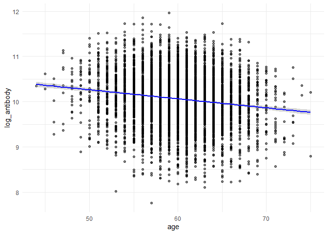<!-- -->

``` r
ggplot(dat1, aes(x = height, y = log_antibody)) + 
  geom_point(alpha = 0.5) + 
  geom_smooth(method = "lm", col = "blue") + 
  theme_minimal()
```

    ## `geom_smooth()` using formula = 'y ~ x'

<!-- -->

``` r
ggplot(dat1, aes(x = weight, y = log_antibody)) + 
  geom_point(alpha = 0.5) + 
  geom_smooth(method = "lm", col = "blue") + 
  theme_minimal()
```

    ## `geom_smooth()` using formula = 'y ~ x'

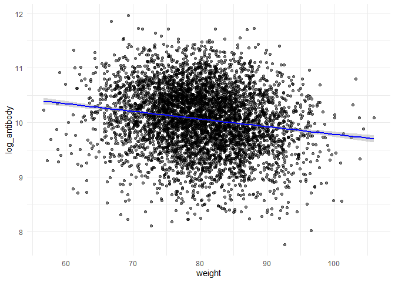<!-- -->

``` r
ggplot(dat1, aes(x = bmi, y = log_antibody)) + 
  geom_point(alpha = 0.5) + 
  geom_smooth(method = "lm", col = "blue") + 
  theme_minimal()
```

    ## `geom_smooth()` using formula = 'y ~ x'

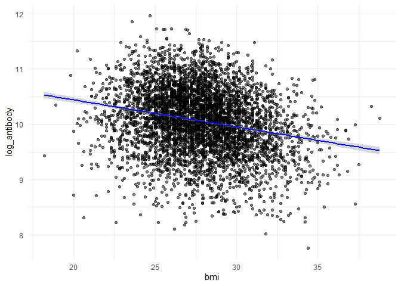<!-- -->

``` r
ggplot(dat1, aes(x = SBP, y = log_antibody)) + 
  geom_point(alpha = 0.5) + 
  geom_smooth(method = "lm", col = "blue") + 
  theme_minimal()
```

    ## `geom_smooth()` using formula = 'y ~ x'

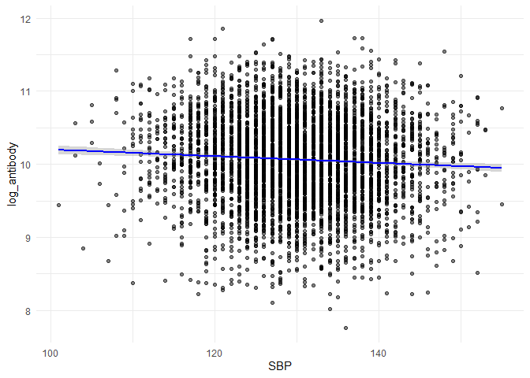<!-- -->

``` r
ggplot(dat1, aes(x = LDL, y = log_antibody)) + 
  geom_point(alpha = 0.5) + 
  geom_smooth(method = "lm", col = "blue") + 
  theme_minimal()
```

    ## `geom_smooth()` using formula = 'y ~ x'

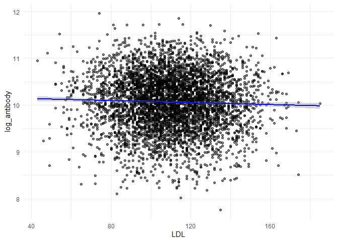<!-- -->

``` r
ggplot(dat1, aes(x = time, y = log_antibody)) + 
  geom_point(alpha = 0.5) + 
  geom_smooth(method = "lm", col = "blue") + 
  theme_minimal()
```

    ## `geom_smooth()` using formula = 'y ~ x'

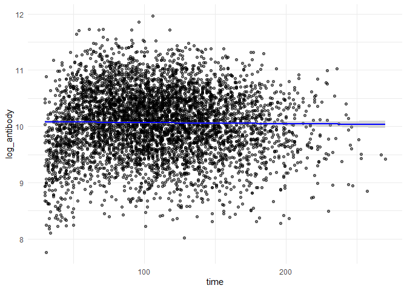<!-- -->

## Repeat for dat2

## Observe first couple rows

``` r
head(dat2)
```

    ##        id age gender race smoking height weight  bmi diabetes hypertension SBP
    ## 5001 5001  58      0    4       1  176.4   86.4 27.7        0            0 130
    ## 5002 5002  62      0    1       1  167.5   82.4 29.4        1            0 123
    ## 5003 5003  71      0    4       0  179.3   79.2 24.6        1            1 145
    ## 5004 5004  59      1    1       0  170.0   81.0 28.0        0            0 123
    ## 5005 5005  69      1    1       0  166.5   74.8 27.0        1            1 150
    ## 5006 5006  56      0    1       0  167.6   74.8 26.6        0            0 121
    ##      LDL time log_antibody
    ## 5001 115  205     9.810890
    ## 5002 118  229     9.076660
    ## 5003 149  206    10.432296
    ## 5004 119  163     9.831918
    ## 5005 142  240     9.074990
    ## 5006 112  206    10.182070

``` r
str(dat2)
```

    ## 'data.frame':    1000 obs. of  14 variables:
    ##  $ id          : int  5001 5002 5003 5004 5005 5006 5007 5008 5009 5010 ...
    ##  $ age         : num  58 62 71 59 69 56 65 61 62 68 ...
    ##  $ gender      : int  0 0 0 1 1 0 0 1 0 0 ...
    ##  $ race        : Factor w/ 4 levels "1","2","3","4": 4 1 4 1 1 1 1 1 1 4 ...
    ##  $ smoking     : Factor w/ 3 levels "0","1","2": 2 2 1 1 1 1 1 2 1 1 ...
    ##  $ height      : num  176 168 179 170 166 ...
    ##  $ weight      : num  86.4 82.4 79.2 81 74.8 74.8 69.2 81.3 82.1 74.4 ...
    ##  $ bmi         : num  27.7 29.4 24.6 28 27 26.6 22.4 27.4 30.7 26.7 ...
    ##  $ diabetes    : int  0 1 1 0 1 0 0 0 0 0 ...
    ##  $ hypertension: num  0 0 1 0 1 0 1 0 1 1 ...
    ##  $ SBP         : num  130 123 145 123 150 121 132 120 142 137 ...
    ##  $ LDL         : num  115 118 149 119 142 112 127 76 86 123 ...
    ##  $ time        : num  205 229 206 163 240 206 285 185 124 127 ...
    ##  $ log_antibody: num  9.81 9.08 10.43 9.83 9.07 ...

``` r
summary(dat2)
```

    ##        id            age            gender      race    smoking     height     
    ##  Min.   :5001   Min.   :46.00   Min.   :0.000   1:663   0:601   Min.   :149.4  
    ##  1st Qu.:5251   1st Qu.:57.00   1st Qu.:0.000   2: 55   1:296   1st Qu.:166.1  
    ##  Median :5500   Median :60.00   Median :0.000   3:199   2:103   Median :170.2  
    ##  Mean   :5500   Mean   :60.02   Mean   :0.491   4: 83           Mean   :170.2  
    ##  3rd Qu.:5750   3rd Qu.:63.00   3rd Qu.:1.000                   3rd Qu.:174.2  
    ##  Max.   :6000   Max.   :75.00   Max.   :1.000                   Max.   :190.6  
    ##      weight            bmi           diabetes      hypertension  
    ##  Min.   : 58.80   Min.   :19.80   Min.   :0.000   Min.   :0.000  
    ##  1st Qu.: 75.30   1st Qu.:25.80   1st Qu.:0.000   1st Qu.:0.000  
    ##  Median : 80.20   Median :27.60   Median :0.000   Median :0.000  
    ##  Mean   : 80.13   Mean   :27.72   Mean   :0.157   Mean   :0.456  
    ##  3rd Qu.: 84.40   3rd Qu.:29.60   3rd Qu.:0.000   3rd Qu.:1.000  
    ##  Max.   :101.60   Max.   :35.80   Max.   :1.000   Max.   :1.000  
    ##       SBP             LDL             time        log_antibody   
    ##  Min.   :106.0   Min.   : 46.0   Min.   : 61.0   Min.   : 8.048  
    ##  1st Qu.:124.0   1st Qu.: 96.0   1st Qu.:140.0   1st Qu.: 9.502  
    ##  Median :130.0   Median :112.0   Median :171.0   Median : 9.935  
    ##  Mean   :129.6   Mean   :110.2   Mean   :173.8   Mean   : 9.897  
    ##  3rd Qu.:135.0   3rd Qu.:124.0   3rd Qu.:205.0   3rd Qu.:10.315  
    ##  Max.   :156.0   Max.   :174.0   Max.   :330.0   Max.   :11.852

## Check for missing values

``` r
colSums(is.na(dat2))
```

    ##           id          age       gender         race      smoking       height 
    ##            0            0            0            0            0            0 
    ##       weight          bmi     diabetes hypertension          SBP          LDL 
    ##            0            0            0            0            0            0 
    ##         time log_antibody 
    ##            0            0

## Check for duplicates

``` r
sum(duplicated(dat2))
```

    ## [1] 0

## Histogram for distribution of log-transformed antibody levels

``` r
ggplot(dat2, aes(x = log_antibody)) + 
  geom_histogram(bins = 30, fill = "green", alpha = 0.5) + 
  theme_minimal() + 
  labs(title = "Distribution of Log-Antibody Levels",
       x = "Log-Antibody Level",
       y = "Frequency")
```

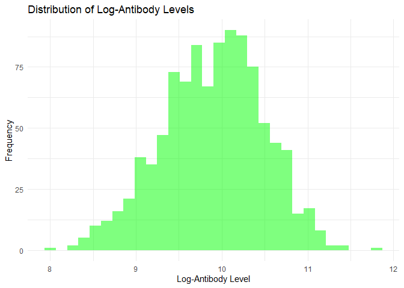<!-- --> \##
Assess outliers

``` r
ggplot(dat2, aes(y = log_antibody)) +
  geom_boxplot(fill = "blue", alpha = 0.5) + 
  theme_minimal()
```

<!-- -->

## Summarize continuous variables

``` r
summary(dat2[, c("age", "height", "weight", "bmi", "SBP", "LDL", "time", "log_antibody")])
```

    ##       age            height          weight            bmi       
    ##  Min.   :46.00   Min.   :149.4   Min.   : 58.80   Min.   :19.80  
    ##  1st Qu.:57.00   1st Qu.:166.1   1st Qu.: 75.30   1st Qu.:25.80  
    ##  Median :60.00   Median :170.2   Median : 80.20   Median :27.60  
    ##  Mean   :60.02   Mean   :170.2   Mean   : 80.13   Mean   :27.72  
    ##  3rd Qu.:63.00   3rd Qu.:174.2   3rd Qu.: 84.40   3rd Qu.:29.60  
    ##  Max.   :75.00   Max.   :190.6   Max.   :101.60   Max.   :35.80  
    ##       SBP             LDL             time        log_antibody   
    ##  Min.   :106.0   Min.   : 46.0   Min.   : 61.0   Min.   : 8.048  
    ##  1st Qu.:124.0   1st Qu.: 96.0   1st Qu.:140.0   1st Qu.: 9.502  
    ##  Median :130.0   Median :112.0   Median :171.0   Median : 9.935  
    ##  Mean   :129.6   Mean   :110.2   Mean   :173.8   Mean   : 9.897  
    ##  3rd Qu.:135.0   3rd Qu.:124.0   3rd Qu.:205.0   3rd Qu.:10.315  
    ##  Max.   :156.0   Max.   :174.0   Max.   :330.0   Max.   :11.852

## Assess correlation among continuous variables

``` r
cor(dat2[, c("age", "height", "weight", "bmi", "SBP", "LDL", "time", "log_antibody")])
```

    ##                      age      height      weight           bmi         SBP
    ## age           1.00000000  0.01798237 -0.02463596 -0.0339202130  0.49930403
    ## height        0.01798237  1.00000000  0.20220998 -0.5253746729 -0.01003387
    ## weight       -0.02463596  0.20220998  1.00000000  0.7242445669 -0.07821894
    ## bmi          -0.03392021 -0.52537467  0.72424457  1.0000000000 -0.06139821
    ## SBP           0.49930403 -0.01003387 -0.07821894 -0.0613982094  1.00000000
    ## LDL           0.18675915 -0.02426887 -0.01989479 -0.0002632226  0.23895512
    ## time         -0.04239180  0.03177441 -0.04599080 -0.0616083609  0.01860855
    ## log_antibody -0.07581041  0.08390950 -0.11496483 -0.1638775639 -0.01002340
    ##                        LDL        time log_antibody
    ## age           0.1867591543 -0.04239180  -0.07581041
    ## height       -0.0242688747  0.03177441   0.08390950
    ## weight       -0.0198947855 -0.04599080  -0.11496483
    ## bmi          -0.0002632226 -0.06160836  -0.16387756
    ## SBP           0.2389551203  0.01860855  -0.01002340
    ## LDL           1.0000000000  0.04049703  -0.00186483
    ## time          0.0404970331  1.00000000  -0.24812211
    ## log_antibody -0.0018648302 -0.24812211   1.00000000

## Assess relationship between log_antibody and continuous variables

``` r
ggplot(dat2, aes(x = age, y = log_antibody)) + 
  geom_point(alpha = 0.5) + 
  geom_smooth(method = "lm", col = "blue") + 
  theme_minimal()
```

    ## `geom_smooth()` using formula = 'y ~ x'

<!-- -->

``` r
ggplot(dat2, aes(x = height, y = log_antibody)) + 
  geom_point(alpha = 0.5) + 
  geom_smooth(method = "lm", col = "blue") + 
  theme_minimal()
```

    ## `geom_smooth()` using formula = 'y ~ x'

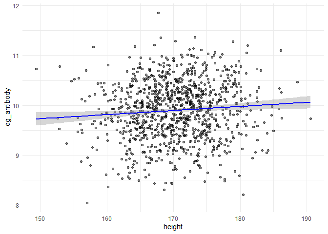<!-- -->

``` r
ggplot(dat2, aes(x = weight, y = log_antibody)) + 
  geom_point(alpha = 0.5) + 
  geom_smooth(method = "lm", col = "blue") + 
  theme_minimal()
```

    ## `geom_smooth()` using formula = 'y ~ x'

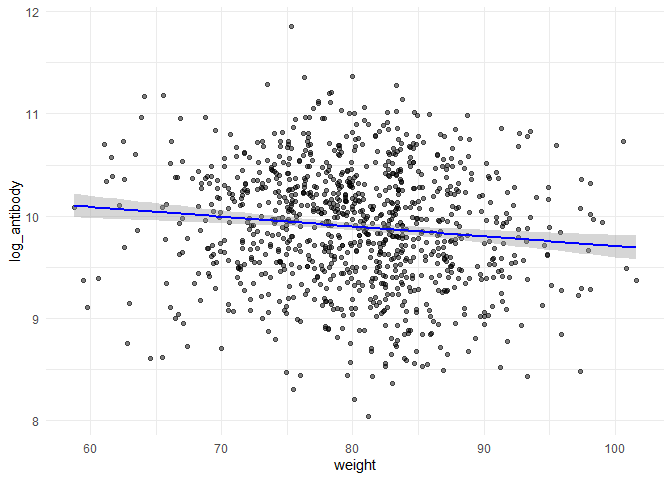<!-- -->

``` r
ggplot(dat2, aes(x = bmi, y = log_antibody)) + 
  geom_point(alpha = 0.5) + 
  geom_smooth(method = "lm", col = "blue") + 
  theme_minimal()
```

    ## `geom_smooth()` using formula = 'y ~ x'

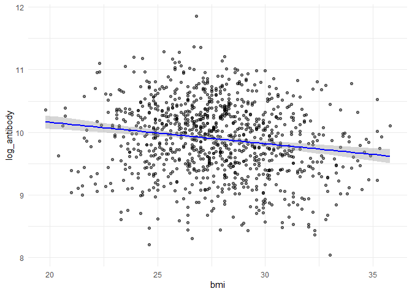<!-- -->

``` r
ggplot(dat2, aes(x = SBP, y = log_antibody)) + 
  geom_point(alpha = 0.5) + 
  geom_smooth(method = "lm", col = "blue") + 
  theme_minimal()
```

    ## `geom_smooth()` using formula = 'y ~ x'

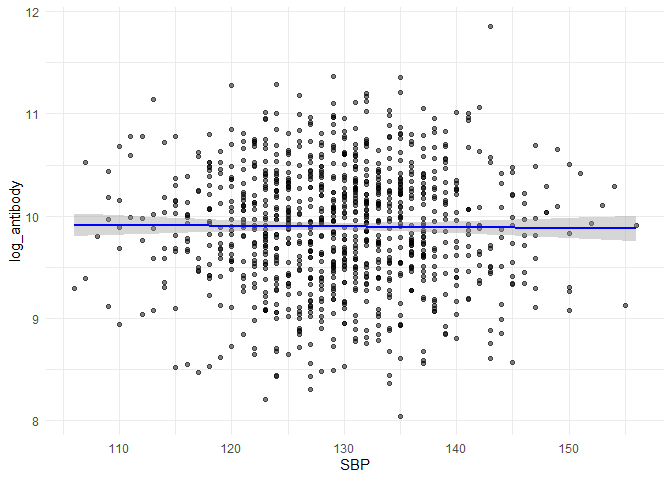<!-- -->

``` r
ggplot(dat2, aes(x = LDL, y = log_antibody)) + 
  geom_point(alpha = 0.5) + 
  geom_smooth(method = "lm", col = "blue") + 
  theme_minimal()
```

    ## `geom_smooth()` using formula = 'y ~ x'

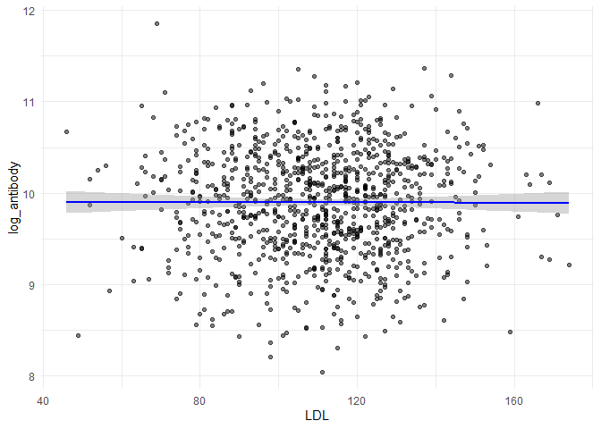<!-- -->

``` r
ggplot(dat2, aes(x = time, y = log_antibody)) + 
  geom_point(alpha = 0.5) + 
  geom_smooth(method = "lm", col = "blue") + 
  theme_minimal()
```

    ## `geom_smooth()` using formula = 'y ~ x'

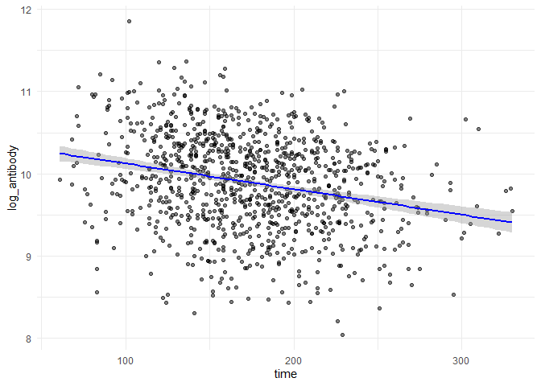<!-- -->

### Assessing lineraity of Dat1

``` r
data(dat1)
```

    ## Warning in data(dat1): data set 'dat1' not found

``` r
x = model.matrix(log_antibody ~ ., dat1)
y = dat1$log_antibody

theme1 <- trellis.par.get()
theme1$plot.symbol$col <- rgb(.2, .4, .2, .5)
theme1$plot.symbol$pch <- 16
theme1$plot.line$col <- rgb(.8, .1, .1, 1)
theme1$plot.line$lwd <- 2
theme1$strip.background$col <- rgb(.0, .2, .6, .2)

trellis.par.set(theme1)

featurePlot(x[, -c(5, 7)], y, plot = "scatter", labels = c("", "Y"),
type = c("p"), layout = c(3, 2))
```

<!-- -->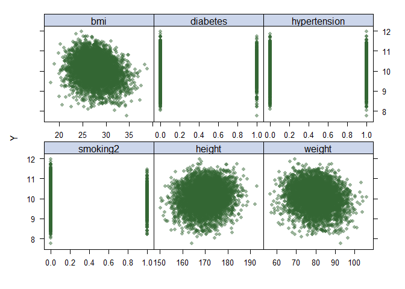<!-- -->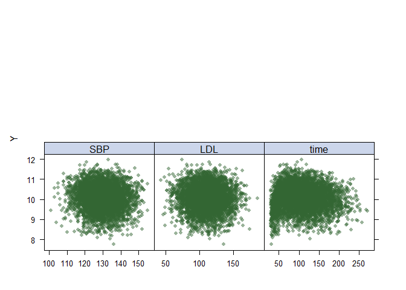<!-- -->

### Creating factors for the Race and Smoking variables to use in the model–for Dat1

``` r
dat1$race = factor(dat1$race, 
                         levels = c(1, 2, 3, 4), 
                         labels = c("White", "Asian", "Black", "Hispanic"))

dat1$smoking = factor(dat1$smoking, 
                            levels = c(0, 1, 2), 
                            labels = c("Never", "Former", "Current"))

dat1$race = relevel(dat1$race, ref = "White")
dat1$smoking = relevel(dat1$smoking, ref = "Never")
```

### Generalized Additive Model (GAM)–Using Dat1 data

``` r
set.seed(2)

gam.m1 = gam(log_antibody ~ age + gender + race + smoking + height + weight + bmi + diabetes + hypertension + SBP + LDL + time,
data = dat1)

gam.m2 = gam(log_antibody ~ s(age) + gender + race + smoking + height + weight + s(bmi) + diabetes + hypertension + s(SBP) + s(LDL) + s(time),
data = dat1)

gam.m3 = gam(log_antibody ~ s(age) + gender + race + smoking + te(height, weight) + s(bmi) + diabetes + hypertension + s(SBP) + s(LDL) + s(time),
data = dat1)

anova(gam.m1, gam.m2, gam.m3, test = "F")
```

    ## Analysis of Deviance Table
    ## 
    ## Model 1: log_antibody ~ age + gender + race + smoking + height + weight + 
    ##     bmi + diabetes + hypertension + SBP + LDL + time
    ## Model 2: log_antibody ~ s(age) + gender + race + smoking + height + weight + 
    ##     s(bmi) + diabetes + hypertension + s(SBP) + s(LDL) + s(time)
    ## Model 3: log_antibody ~ s(age) + gender + race + smoking + te(height, 
    ##     weight) + s(bmi) + diabetes + hypertension + s(SBP) + s(LDL) + 
    ##     s(time)
    ##   Resid. Df Resid. Dev      Df Deviance       F Pr(>F)    
    ## 1    4984.0     1509.4                                    
    ## 2    4971.2     1380.0 12.8235  129.390 36.3775 <2e-16 ***
    ## 3    4968.5     1378.8  2.6365    1.235  1.6882 0.1739    
    ## ---
    ## Signif. codes:  0 '***' 0.001 '**' 0.01 '*' 0.05 '.' 0.1 ' ' 1

``` r
plot(gam.m2)
```

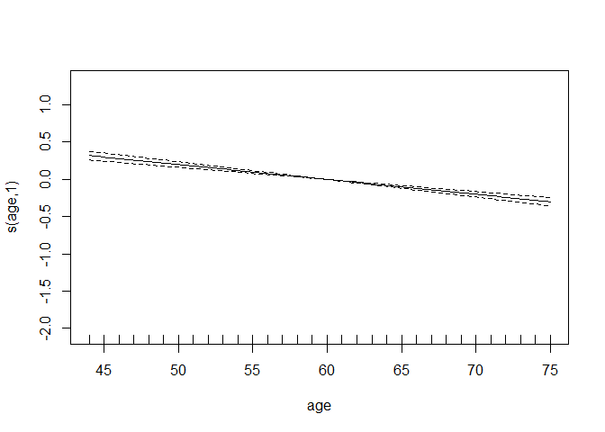<!-- -->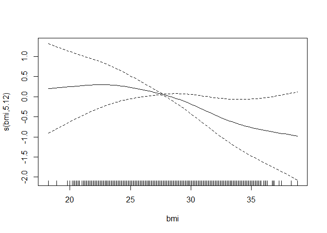<!-- -->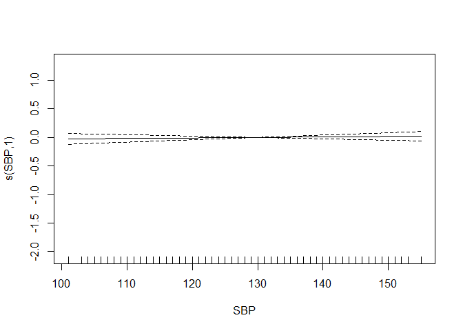<!-- -->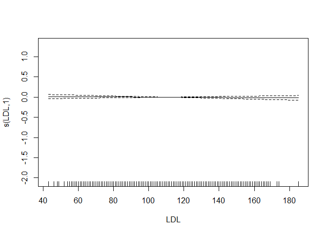<!-- -->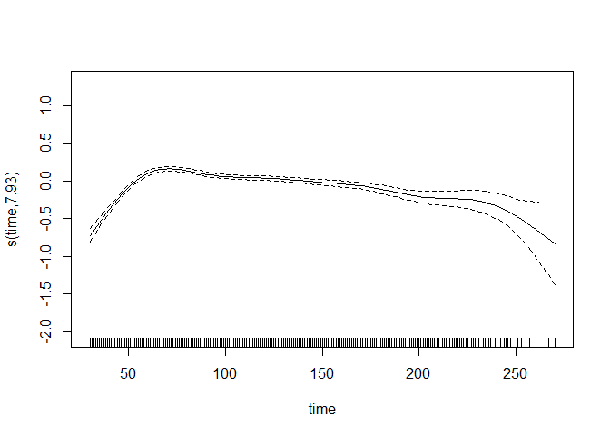<!-- -->

``` r
vis.gam(gam.m3, view = c("height","weight"),
color = "topo")
```

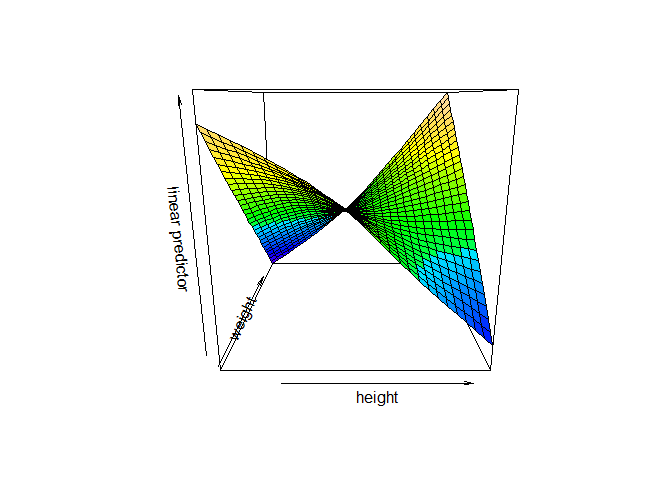<!-- -->

``` r
ctrl1 = trainControl(method = "cv", number = 10)
x = dat1[, c("age", "gender", "race", "smoking", "height", "weight", "bmi", 
              "diabetes", "hypertension", "SBP", "LDL", "time")]
y = dat1$log_antibody

set.seed(2)
gam.fit = train(x, y,
method = "gam",
trControl = ctrl1)
gam.fit$bestTune
```

    ##   select method
    ## 2   TRUE GCV.Cp

``` r
gam.fit$finalModel
```

    ## 
    ## Family: gaussian 
    ## Link function: identity 
    ## 
    ## Formula:
    ## .outcome ~ gender + diabetes + hypertension + smoking + race + 
    ##     s(age) + s(SBP) + s(LDL) + s(bmi) + s(time) + s(height) + 
    ##     s(weight)
    ## 
    ## Estimated degrees of freedom:
    ## 0.991 0.000 0.000 4.179 7.892 1.234 0.000 
    ##  total = 23.3 
    ## 
    ## GCV score: 0.2786734

### Assessing lineraity of Dat2

``` r
data(dat2)
```

    ## Warning in data(dat2): data set 'dat2' not found

``` r
x = model.matrix(log_antibody ~ ., dat2)
y = dat2$log_antibody

theme1 <- trellis.par.get()
theme1$plot.symbol$col <- rgb(.2, .4, .2, .5)
theme1$plot.symbol$pch <- 16
theme1$plot.line$col <- rgb(.8, .1, .1, 1)
theme1$plot.line$lwd <- 2
theme1$strip.background$col <- rgb(.0, .2, .6, .2)

trellis.par.set(theme1)

featurePlot(x[, -c(5, 7)], y, plot = "scatter", labels = c("", "Y"),
type = c("p"), layout = c(3, 2))
```

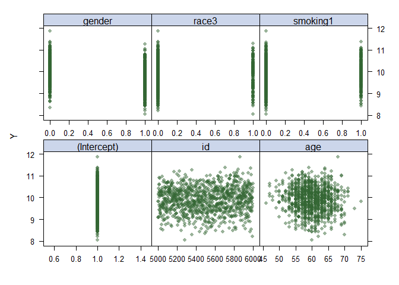<!-- -->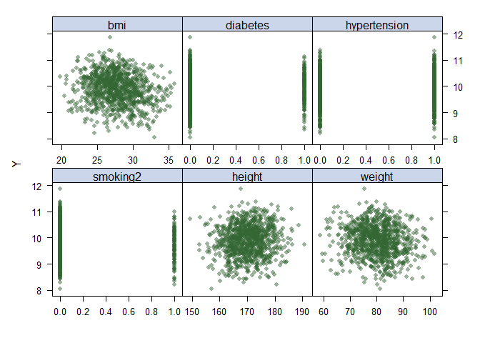<!-- -->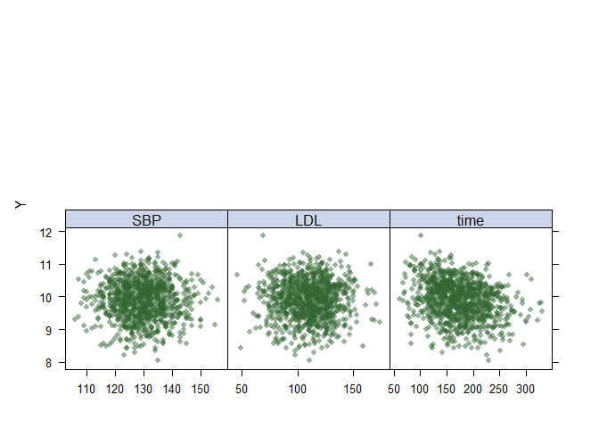<!-- -->

### Creating factors for the Race and Smoking variables to use in the model–for Dat2

``` r
dat2$race = factor(dat2$race, 
                         levels = c(1, 2, 3, 4), 
                         labels = c("White", "Asian", "Black", "Hispanic"))

dat2$smoking = factor(dat2$smoking, 
                            levels = c(0, 1, 2), 
                            labels = c("Never", "Former", "Current"))

dat2$race = relevel(dat2$race, ref = "White")
dat2$smoking = relevel(dat2$smoking, ref = "Never")
```

### Generalized Additive Model (GAM)–Using Dat2 data

``` r
set.seed(2)

gam.m1 = gam(log_antibody ~ age + gender + race + smoking + height + weight + bmi + diabetes + hypertension + SBP + LDL + time,
data = dat2)

gam.m2 = gam(log_antibody ~ s(age) + gender + race + smoking + height + weight + s(bmi) + diabetes + hypertension + s(SBP) + s(LDL) + s(time),
data = dat2)

gam.m3 = gam(log_antibody ~ s(age) + gender + race + smoking + te(height, weight) + s(bmi) + diabetes + hypertension + s(SBP) + s(LDL) + s(time),
data = dat2)

anova(gam.m1, gam.m2, gam.m3, test = "F")
```

    ## Analysis of Deviance Table
    ## 
    ## Model 1: log_antibody ~ age + gender + race + smoking + height + weight + 
    ##     bmi + diabetes + hypertension + SBP + LDL + time
    ## Model 2: log_antibody ~ s(age) + gender + race + smoking + height + weight + 
    ##     s(bmi) + diabetes + hypertension + s(SBP) + s(LDL) + s(time)
    ## Model 3: log_antibody ~ s(age) + gender + race + smoking + te(height, 
    ##     weight) + s(bmi) + diabetes + hypertension + s(SBP) + s(LDL) + 
    ##     s(time)
    ##   Resid. Df Resid. Dev     Df Deviance      F    Pr(>F)    
    ## 1    984.00     275.45                                     
    ## 2    977.78     268.58 6.2180   6.8762 4.0342 0.0004416 ***
    ## 3    976.63     268.27 1.1497   0.3038 0.9640 0.3384056    
    ## ---
    ## Signif. codes:  0 '***' 0.001 '**' 0.01 '*' 0.05 '.' 0.1 ' ' 1

``` r
plot(gam.m2)
```

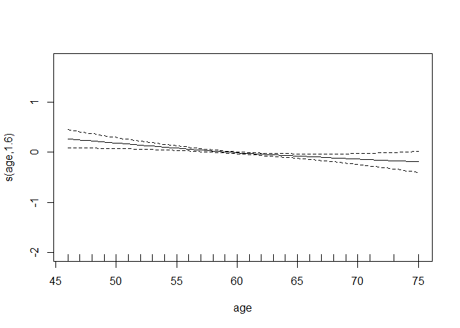<!-- -->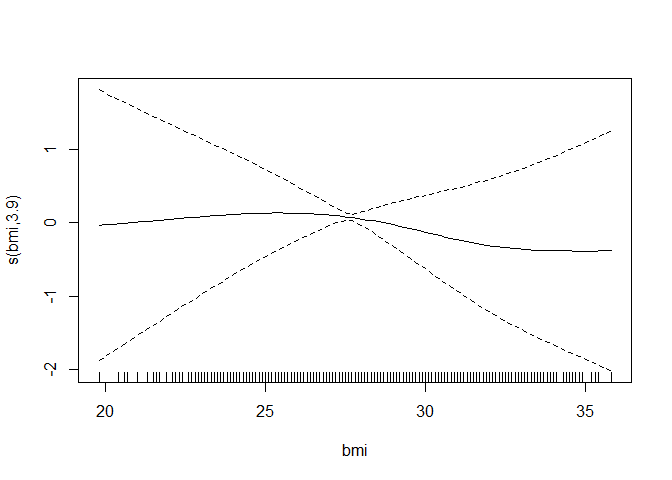<!-- -->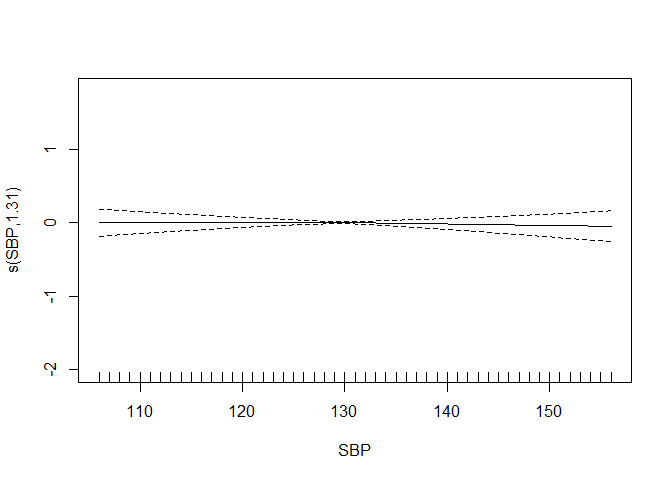<!-- -->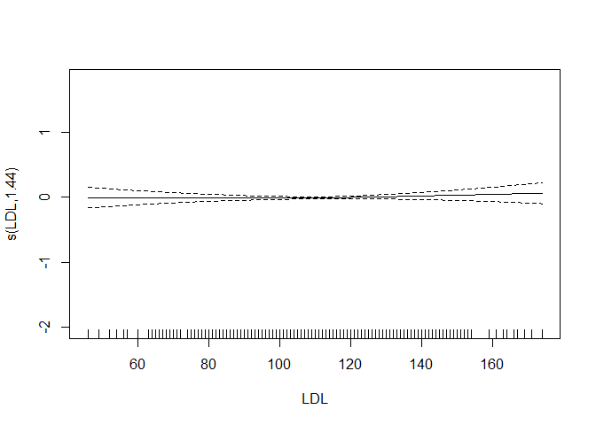<!-- -->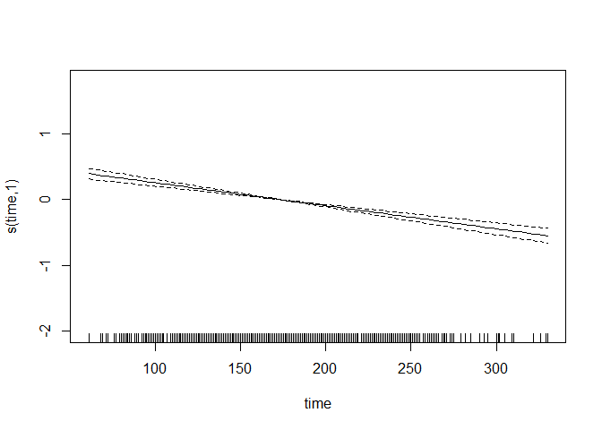<!-- -->

``` r
vis.gam(gam.m3, view = c("height","weight"),
color = "topo")
```

<!-- -->

``` r
ctrl1 = trainControl(method = "cv", number = 10)
x = dat1[, c("age", "gender", "race", "smoking", "height", "weight", "bmi", 
              "diabetes", "hypertension", "SBP", "LDL", "time")]
y = dat1$log_antibody

set.seed(2)
gam.fit = train(x, y,
method = "gam",
trControl = ctrl1)
gam.fit$bestTune
```

    ##   select method
    ## 2   TRUE GCV.Cp

``` r
gam.fit$finalModel
```

    ## 
    ## Family: gaussian 
    ## Link function: identity 
    ## 
    ## Formula:
    ## .outcome ~ gender + diabetes + hypertension + smoking + race + 
    ##     s(age) + s(SBP) + s(LDL) + s(bmi) + s(time) + s(height) + 
    ##     s(weight)
    ## 
    ## Estimated degrees of freedom:
    ## 0.991 0.000 0.000 4.179 7.892 1.234 0.000 
    ##  total = 23.3 
    ## 
    ## GCV score: 0.2786734
